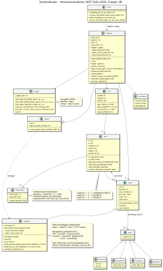

<h2 style="page-break-before: always;">1. Systemdesign</h2>

## Überblick

Das System besteht aus drei Schichten: **Infrastruktur** (Parser, Manager, Logger), **Gridwelt** (Grid, Field, ItemInstance) und **Agenten** (AntAgent mit Aktionen). Der Manager orchestriert den gesamten Simulationsablauf; Agenten sind reaktiv und kommunizieren ausschließlich über Pheromonspuren auf dem Grid.



---

## Kernkomponenten

**Parser** liest eine JSON-Modelldatei ein und löst Simulationsvarianten (Override-Mechanismus) auf. Mit dem Flag `--visual` werden Logs in `logs/visual/` statt `logs/` geschrieben, sodass visuelle und reguläre Logs nie überschrieben werden.

**Manager** führt pro Tick folgende Schritte aus (in dieser Reihenfolge):

```
1. process_actions()          – Aktionen aus dem Vorschritt ausführen
2. refresh_energy()           – Energie an Nest/Futterfeld auffüllen
3. evaporate_pheromones()     – multiplikative Verdunstung aller Pheromontypen
4. check_deaths()             – Ameisen mit Energie ≤ 0 entfernen
5. log_tick_summary()         – Effizienz, Quellrestmengen, alive/carriers loggen
6. trigger_agents()           – sense → reason → act für jeden lebenden Agenten
```

**Field** speichert Agenten und Items (Nahrung, pheromone_nest, pheromone_food). `capacity = 0` markiert ein Hindernis; `capacity = 999` ist praktisch unbegrenzt (Nest). Pheromone sind reguläre Items mit `evaporation_rate > 0`.

**ItemInstance** verwendet **multiplikative Verdunstung** (`quantity *= 1 − rate`): veraltete Spuren verschwinden exponentiell in ~60 Ticks, aktive Spuren stabilisieren sich auf einem Gleichgewichtswert.

---

## Navigationslogik

Der `AntAgent` setzt den reaktiven Ameisenalgorithmus mit folgenden Designentscheidungen um:

1. **4-Nachbarschaft:** Jedes Feld hat vier Nachbarfelder (oben, unten, links, rechts).
2. **Probabilistische Navigation:** Die Wahrscheinlichkeit, ein Nachbarfeld zu wählen, ergibt sich aus:

$$P(f) = \frac{\text{score}(f)}{\sum_{f'} \text{score}(f')}$$

wobei `score(f) = max(0.01, pheromon(f) + 0.05 − penalty(f))`. Die `penalty` bestraft zuletzt besuchte Felder, um Kurzzyklen zu vermeiden (Kurzzeitgedächtnis der letzten 8 Positionen).

3. **Rückweg zum Nest:** Beim Tragen von Nahrung verfolgt die Ameise zunächst den gespeicherten Hinlauf-Pfad (`_trail`) zurück, bevor sie dem Nest-Pheromon-Gradienten folgt.
4. **Anti-Backtrack:** Die entgegengesetzte Richtung zum letzten Schritt wird durch die Penalty-Logik probabilistisch benachteiligt.
5. **Kapazität -1:** Im Kapazitäts-Array eines Agenten steht `"max": -1` für "keine Obergrenze". Diese Konvention betrifft ausschließlich Pheromon-Items, da Ameisen beliebig viel Pheromon ablegen dürfen.

---

## Logging & Effizienzmetrik

Jedes `tick_summary`-Event enthält:

| Feld | Beschreibung |
|---|---|
| `food_at_nest` | absolut gelieferte Einheiten |
| `efficiency_pct` | `food_at_nest / initial_total × 100` (normalisiert) |
| `food_sources` | Restmenge pro Quelle (Key: `"x,y"`) |
| `alive` / `carriers` / `searchers` | Koloniezustand |

`efficiency_pct` ist die primäre Metrik zur Beantwortung der Forschungsfrage, da sie unabhängig von der absoluten Quellgröße ist.

---

## Änderungen gegenüber der Projektskizze

| Aspekt | Projektskizze | Aktuelle Implementierung |
|---|---|---|
| Pheromonabgabe | konstanter Wert | abnehmend: `base × 0.97^steps` |
| Verdunstung | linear (`quantity − rate`) | multiplikativ (`quantity × (1−rate)`) |
| isFacing | explizites Richtungsfeld | implizit via `_recent_positions`-Penalty |
| Logging | food_found / delivered / death | + `food_sources`, `efficiency_pct` pro Tick |
| Log-Pfade | einheitlich `logs/` | getrennt: `logs/` vs. `logs/visual/` |
| Reproduzierbarkeit | kein Seed | `"seed": 42` in allen Experimenten |
| Energiewerte Exp1 | alle gleich | n×E=3000 konstant (5→600, 10→300, 20→150) |

---

