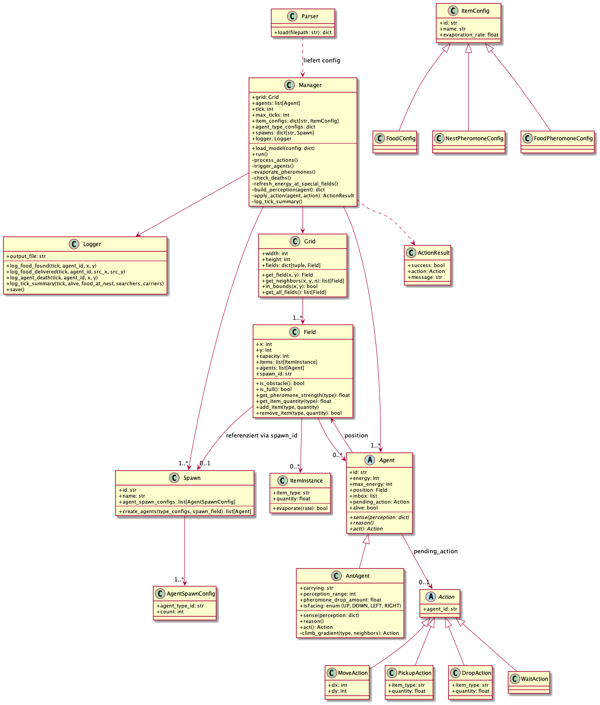
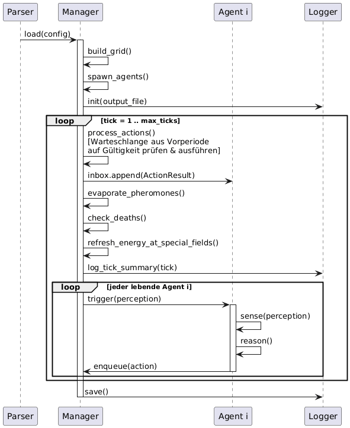

<div style="display: flex; flex-direction: column; justify-content: center; align-items: center; min-height: 90vh; max-height: 90vh; margin: 0; padding: 0; text-align: center; box-sizing: border-box;">
  <h1 style="margin: 0 0 0.5em 0;">Projektskizze</h1>
  <p style="margin: 0 0 1em 0;">TU Berlin – SoSe 2026 – Agententechnologien - Gruppe 18</p>
  <p style="margin: 0;">Moritz Clerc 498074, Carlos Driller 495897, David Brandes 495394</p>
</div>

<h2 style="page-break-before: always;">1. Systemdesign – Klassendiagramm</h2>




### Erläuterung

Der `Manager` ist die zentrale Instanz des Systems.
Der `Manager` liest die Modelldatei für ein Experiment per `Parser` ein und führt eine Simulation des Experimets durch. 
Jeweils ein `Manager` wird pro Simulation im gleichen Experiment instanziiert.
Die relevanten Ereignisse loggt der `Manager` mithilfe des `Logger`.


Ein `Grid` ist eine n x m-matrix von `Field`-Objekten. Koordinatenursprung (0,0) ist unten links.

Ein `Field` repräsentiert eine Zelle. `capacity == 0` bedeutet Hindernis. Felder mit einer `spawn_id="nest_*"` sind Nester und frischen die Energie eines eintreffenden `AntAgent` sofort und kostenlos auf.

Ein `Spawn` konfiguriert, welche Agenten in welcher Anzahl erzeugt werden. Für diese Aufgabe gibt es ein `Spawn` an dem ausschließlich Ant-Agenten gespawnt werden, die Abstraktion erlaubt mehrere Spawnpunkte und auch, dass verschiedene Agententypen an der gleichen Stelle gespawnt werden können.

`ItemInstance` ist nicht ein einzelnes Item, sondern eine Anzahl von Items, da nicht jedes Item einzeln instantiiert wird. Über `item_type` wird definiert um welches Item es sich handelt und in den Subklassen von `ItemConfig` werden die Details zu einem Item definiert. Aktuell sind diese Infos nur `id` (diese dient zum linken zwischen `ItemInstance` und der jeweiligen `ItemConfig`), `name` und `evaporation_rate`.

> Info: Config Klassen wie ItemConfig werden in Python benutzt für Daten, die nur gespeichert werden. In den ItemConfig Subklassen werden lediglich Daten über die Eigenschaften von Items gespeichert, deswegen wurde diese Namenskonvention gewählt.

Die `quantity` von einer `ItemInstance` mit `item_type="food"` wird durch Ant-Agenten dekrementiert. Die `quantity` von einer `ItemInstance` mit `item_type="pheromone_nest"` oder `item_type="pheromone_food"` wird in jedem Zeittakt von dem `Manager` basierend auf ihrer `evaporation_rate` dekrementiert, bei Stärke 0 wird die Pheromonen-Instanz entfernt.
Es gibt lediglich zwei Pheremonentypen, Food- und Nestpheremone.

Die Klasse `Agent` ist abstrakt, sodass potentiell weitere Agententypen eingeführt werden können. Die konkrete Subklasse `AntAgent` implementiert den reaktiven Ameisenalgorithmus. Die Wahrnehmung umfasst die Items auf dem eigenen Feld sowie die Pheromonwerte der direkten Nachbarfelder (4-Nachbarschaft). Die Navigation erfolgt probabilistisch.

Ein `AntAgent` kann nur in die Richtungen des Enums `Direction = {UP, DOWN, LEFT, RIGHT}` bewegen. In `isFacing` wird gespeichert in welche Richtung der `AntAgent` zuletzt gegangen ist. Beim Wählen des nächsten Zugs wird die entgegengesetzte Richtung probabilistisch benachteiligt, so dass eine sinnlose Vor-und-Zurück-Bewegung unwahrscheinlicher auftritt.

In einer `Action` steckt die Absicht eines Agenten. Die konkreten Subklassen der abstrakten `Action` Klasse sind: `MoveAction`, `PickupAction`, `DropAction`, `WaitAction`. Der `Manager` prüft jede Aktion auf Gültigkeit und legt das `ActionResult` in die Inbox des Agenten.

Der `Parser` nimmt ein Experiment als JSON (siehe 2. Simulationsmodell) und gibt eine Liste an Simulationen zurück. Für jede Simulation wird ein `Manager` instanziiert. 

## 2. Simulationsmodell (json)

Das folgende Beispiel zeigt die Struktur der Modelldatei für Experiment 1.

```json
{
  "id": "exp1_coldstart_basic",
  "name": "Experiment 1: Cold Start - Grundlegende Nahrungsversorgung",
  "max_ticks": 1000,
  "warmstart": false,
  "description": "Kaltstart ohne vorplatzierte Pheromon-Spuren. Zwei Nahrungsquellen bei (2,2) und (12,12) - je 10 Schritte Manhattan vom Nest (7,7) entfernt. Nahrungsquelle A hat 20 Einheiten (kleiner), B hat 40 Einheiten (größer). Bei kleiner Population (5 Ameisen) wird kaum Nahrung gesammelt, da Spuren zu langsam entstehen - das zeigt eine Schwäche bei geringem Ameisenbestand. Mit 10 und 20 Ameisen wird die Nahrungsversorgung zunehmend effizienter.",
  "item_types": [
    { "id": "food",           "name": "Nahrung",          "evaporation_rate": 0.0  },
    { "id": "pheromone_nest", "name": "Nest-Pheromon",    "evaporation_rate": 0.02 },
    { "id": "pheromone_food", "name": "Nahrung-Pheromon", "evaporation_rate": 0.02 }
  ],
  "agent_types": [
    {
      "id": "ant",
      "name": "Ameise",
      "energy": 300,
      "perception_range": 4,
      "pheromone_drop_amount": 10.0,
      "capacity": [
        { "item_type_id": "food",           "max": 1  },
        { "item_type_id": "pheromone_nest", "max": -1 },
        { "item_type_id": "pheromone_food", "max": -1 }
      ]
    }
  ],
  "spawns": [
    {
      "id": "nest_main",
      "name": "Hauptnest",
      "agent_spawns": [
        { "agent_type_id": "ant", "count": 10 }
      ]
    }
  ],
  "grid": {
    "width": 15,
    "height": 15,
    "default_capacity": 5,
    "fields": [
      { "x": 7,  "y": 7,  "capacity": 999, "spawn_id": "nest_main", "items": [] },
      { "x": 2,  "y": 2,  "capacity": 5,   "items": [{ "item_type_id": "food", "quantity": 20 }] },
      { "x": 12, "y": 12, "capacity": 5,   "items": [{ "item_type_id": "food", "quantity": 40 }] },
      { "x": 4,  "y": 5,  "capacity": 0,   "items": [] },
      { "x": 5,  "y": 5,  "capacity": 0,   "items": [] },
      { "x": 6,  "y": 5,  "capacity": 0,   "items": [] },
      { "x": 8,  "y": 9,  "capacity": 0,   "items": [] },
      { "x": 9,  "y": 9,  "capacity": 0,   "items": [] },
      { "x": 10, "y": 9,  "capacity": 0,   "items": [] }
    ]
  },
  "logging": {
    "events": ["food_found", "food_delivered", "agent_death", "tick_summary"]
  },
  "simulations": [
    {
      "id": "sim_5ants",
      "name": "5 Ameisen",
      "spawns": [
        { "id": "nest_main", "name": "Hauptnest", "agent_spawns": [{ "agent_type_id": "ant", "count": 5 }] }
      ]
    },
    {
      "id": "sim_10ants",
      "name": "10 Ameisen"
    },
    {
      "id": "sim_20ants",
      "name": "20 Ameisen",
      "spawns": [
        { "id": "nest_main", "name": "Hauptnest", "agent_spawns": [{ "agent_type_id": "ant", "count": 20 }] }
      ]
    }
  ]
}

```

Felder, die nicht explizit in `fields` aufgeführt sind, erhalten die für das Grid definierte `default_capacity`.
Hindernisse werden durch `capacity: 0` ausgedrückt.

Warmstart Szenarien können beliebige Pheromonmengen auf Feldern vorbelegen. Das Feld `description` dient dazu, dass durchgeführte Experiment zu beschreiben.

Unter `simulations` werden Einstellungen des Experiments überschrieben. So können mehrere Simulationen zu einem Experiment durchgeführt werden, die sich nur in explizit aufgeführten Parametern unterscheiden. In dem obigen Beispiel unterscheiden sich die drei Simulationen des Experiments nur in der Anzahl der gespawnten Agenten.

---

## 3. Ablauf einer Simulation (Sequenzdiagramm)



### Erläuterung

`Parser` übergibt alle Konfigurationen an den `Manager`, der daraus die Gridwelt aufbaut und die Agenten spawnt.
In jedem Takt verarbeitet der `Manager` zuerst die Aktionswarteschlange aus der Vorperiode indem er jede Aktion validiert und das Ergebnis in die Inbox des jeweiligen Agenten legt.
Konflikte zwischen den Aktionen werden nach dem First-Come-First-Serve Prinzip aufgelöst.
Anschließend erfolgen Pheromonverdunstung, Todeskontrolle und Energieauffrischung für alle Ant-Agenten, die sich beim Nest oder bei einem Nahrungsfeld befinden. Zu guter Letzt triggert der Manager sequenziell jeden lebenden `Agent i`, sodass dieser seinen Sense-Reason-Act-Zyklus durchführt.
`Agent i` liest seine Wahrnehmung (inklusive Inbox-Feedback), entscheidet probabilistisch und stellt die nächste Aktion in die Warteschlange. Somit wird die in Zyklus *k* von `Agent i` beschlossene Aktion erst in Zyklus *k+1* von dem `Manager` ausgeführt (oder als ungültig zurückgewiesen).
Der `Logger` erhält nach jedem Takt eine Zusammenfassung.

---

## 4. Logging

Geloggt wird im jsonl-format (eine json-Zeile pro Ereignis). Folgende Ereignisse werden erfasst:

1. `food_found`: Zeittakt, Agent-Id, Position der Nahrungsquelle ("Ant Agent hat Nahrung aufgenommen")
2. `food_delivered`: Zeittakt, Agent-Id, Ursprungsposition der Nahrung ("Ant Agent hat Nahrung im Nest abgelegt")
3. `agent_death`: Zeittakt, Agent-Id, letzte Position ("Ant Agent ist gestorben")
4. `tick_summary`: Zeittakt, Anzahl lebender Agenten, Gesamtnahrung im Nest, Anzahl Nahrungssucher, Anzahl Nahrungsträger ("Ein Zeittakt ist vorbei")


---

## 5. Forschungsfrage

*Sind wenige Ameisen mit höherer Maximalenergie effizienter in der Ausbeutung der Nahrungsquellen als eine größere Anzahl an Ameisen mit geringerer Maximalenergie?*

Für jedes Experiment wird ein `Grid` mit der Größe 20x20 erzeugt und das Nest in der Mitte, auf dem Feld (10,10), platziert.
Um zu berücksichtigen, dass mehr Ameisen, mehr Futter tragen können, sind die Futterquellen jeweils so groß wie die Ameisenkolonie.
Die 3 Simulationen pro Experiment unterscheiden sich ausschließlich in der Anzahl der Ameisen und in dem maximalen Energievorrat jeder Ameise (und der aus der Anzahl der Ameisen abgeleiteten Größe einer Futterquelle).

1. Simulation: 5 Ameisen mit einem maximalen Energievorrat von 160
2. Simulation: 10 Ameisen mit einem maximalen Energievorrat von 80
3. Simulation: 40 Ameisen mit einem maximalen Energievorrat von 20

> Info: Ameisen haben einen Energievorrat von mindestens 20 damit sie bei einem 20x20 Grid (wo das Nest in der Mitte platziert ist) potentiel eine Futterquelle in einem Eckfeld finden können.

**Experiment 1:**
Es gibt keine Hindernisse und 4 Futterquellen werden per Zufall auf dem Grid platziert.

**Experiment 2:**
Es gibt feste Positionen für 4 Futterquellen und es werden 4 Hindernisse zufällig auf dem Grid platziert.

**Experiment 3:**
Es gibt keine Hindernisse und 10 Futterquellen werden per Zufall auf dem Grid platziert.

Zwischen den Simulationen wird die benötigte Zeit zur kompletten Ausbeutung der Futterquellen verglichen.
